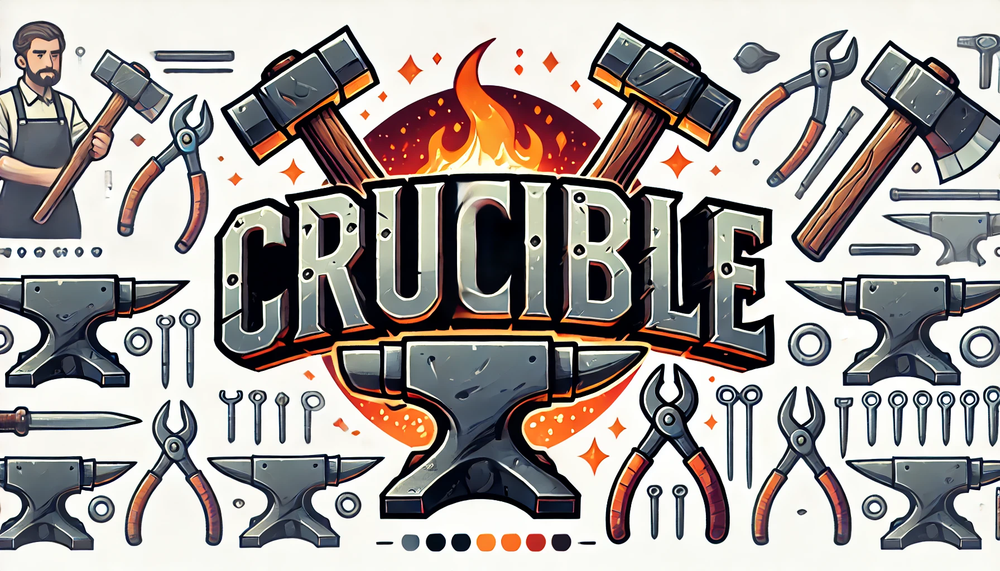
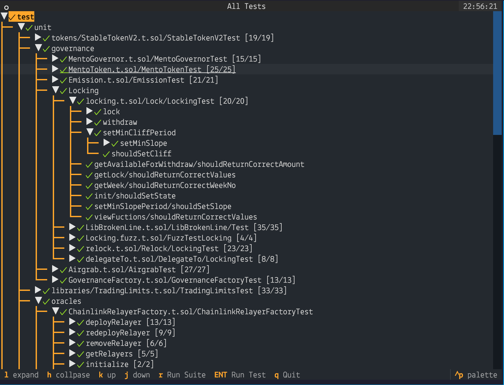

Crucible is a terminal UI application wrapper for [forge test](https://github.com/foundry-rs/foundry) built with [Textual](https://textual.textualize.io/) (💖).
It provides an interactive environment to navigate your test tree and the trace output of running a test with full verbosity.

## Installation

I recommend using [pipx](https://pipx.pypa.io/stable/installation/), which installes applications distributed via pypi into their own virtual environment.

```bash
$ pipx install forge-curcible
```

This will install the `crucible` executable. Then navigate to a foundry project and run:

## Running 

```
$ crucible
```

The app should run the full test suite and output a tree representation:



You can navigate the tree via the arrows or vim-style (recommended 🤓). 
You can also press CTRL+P to bring up the command pallet where you can fuzzy-find tests to run:


Once you pick a test you will see the trace view:


## Disclaimer

This is very alpha software so it might not work. It employs a grammer to parse the forge output.
I've tried it on a variety of tests but it could still fail when opening a test. If it happens it will create
a `/tmp/<test-name>.txt` file with the output. Please open an issue and attach the output 󰕹.


